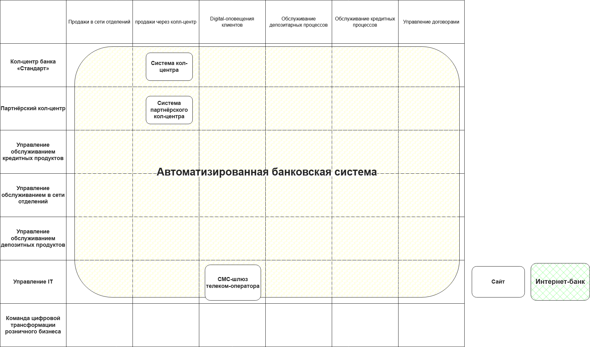
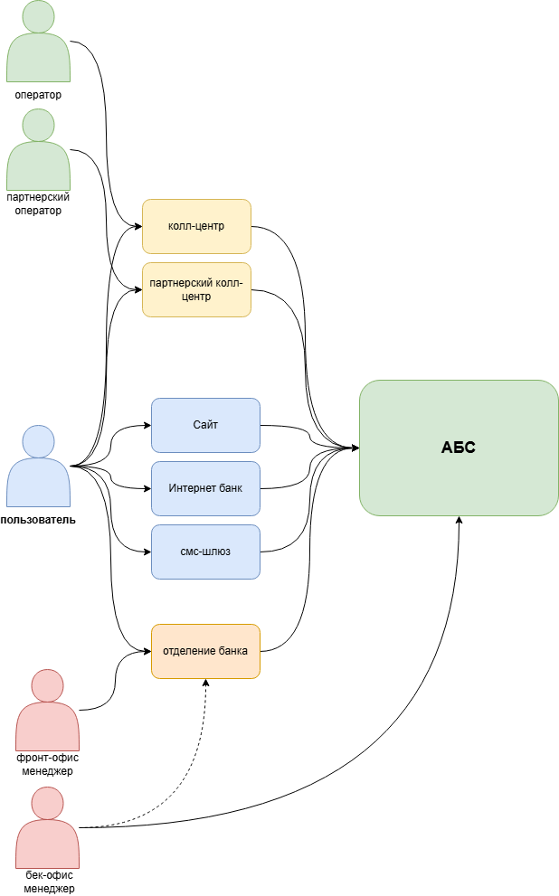

**Карта текущего IT-ландшафта:**

- Сайт выполняет только маркетинговую функцию, а интернет банк в текущем варианте _ограничивается проведением платежей и открытием текущих счетов (дебетовых карт)_. Эти возможности отсутствуют в Business Capability Map, поэтому сайт и интернет-банк вынесены за за таблицу.
- **смс-шлюз** поддерживает IT-отдел, поэтому расположил в строке __управление IT__
- оповещения через смс отнес к **digital-оповещениям**, поэтому **смс-шлюз** относятся к соответствующему столбцу.

--------------------------------------

**Схема интеграции приложений**:

