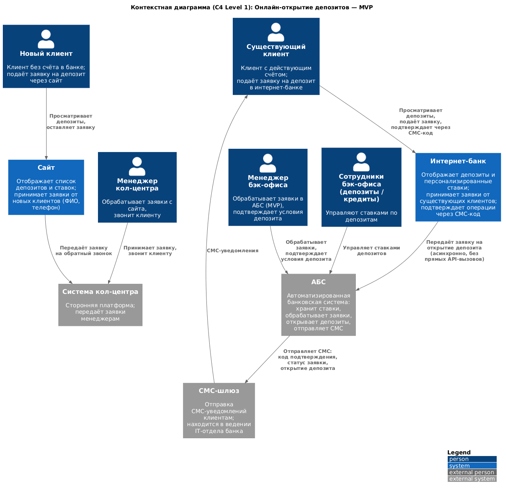
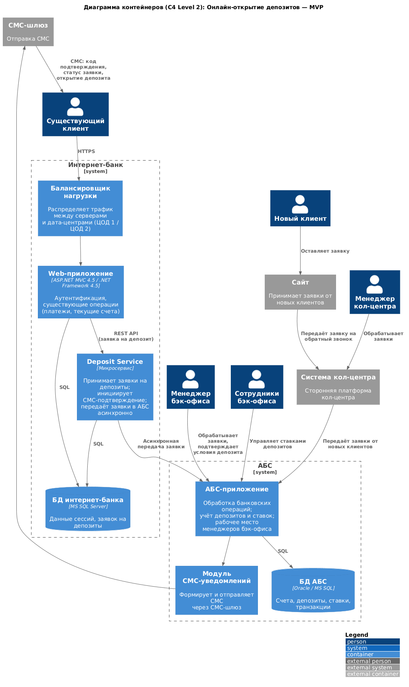

### **Название задачи:**
Онлайн-открытие депозитов — MVP

### **Автор:**

### **Дата:**

---

### **Функциональные требования**

Таблица охватывает Use Cases. На их основе строятся диаграммы контекста и контейнеров и описываются интеграции:

| **№** | **Действующие лица или системы** | **Use Case** | **Описание** |
| :-: | :- | :- | :- |
| 1 | Новый клиент, Сайт | Просмотр депозитов на сайте | Новый клиент просматривает список доступных депозитов с актуальными ставками |
| 2 | Новый клиент, Сайт | Подача заявки через сайт | Новый клиент оставляет заявку (ФИО, телефон); менеджер кол-центра перезванивает |
| 3 | Менеджер кол-центра, Система кол-центра, АБС | Обработка заявки с сайта | Менеджер получает заявку в системе кол-центра, звонит клиенту; при необходимости предлагает особые условия |
| 4 | Новый клиент, Отделение банка | Идентификация клиента | Новый клиент приходит в отделение для идентификации личности |
| 5 | Существующий клиент, Интернет-банк | Просмотр депозитов в интернет-банке | Клиент просматривает список доступных депозитов с актуальными и персонализированными ставками |
| 6 | Существующий клиент, Интернет-банк, АБС | Подача заявки в интернет-банке | Клиент указывает счёт и сумму депозита, подтверждает заявку через СМС-код |
| 7 | Менеджер бэк-офиса, АБС | Обработка заявки (MVP) | Менеджер бэк-офиса обрабатывает заявку вручную и подтверждает условия депозита в АБС |
| 8 | АБС, СМС-шлюз, Существующий клиент | СМС-уведомление о ставке | Клиент получает СМС-уведомление после подтверждения размера ставки |
| 9 | АБС, СМС-шлюз, Существующий клиент | СМС-уведомление об открытии | Клиент получает СМС-уведомление после открытия депозита |
| 10 | Сотрудники бэк-офиса депозитов и кредитов, АБС | Управление ставками | Сотрудники бэк-офиса депозитов и бэк-офиса кредитов управляют ставками по депозитам в АБС |

---

### **Нефункциональные требования**

Таблица охватывает нефункциональные и архитектурно-значимые требования из FURPS+:

| **№** | **Требование** |
| :-: | :- |
| 1 | Все сервисы работают 24/7 с доступностью 99,9% |
| 2 | При сбое основного ЦОД интернет-банк остаётся доступным через резервный ЦОД |
| 3 | Прямые вызовы из интернет-банка в АБС для новых процессов недопустимы |
| 4 | Интернет-банк поддерживает горизонтальное масштабирование: балансировка нагрузки между серверами, приложениями и дата-центрами |
| 5 | АБС масштабируется только вертикально (ограничение СУБД) |
| 6 | Время отклика на все пользовательские действия — миллисекунды |
| 7 | Использовать максимум существующих технологий (MS SQL, Oracle); новые технологии должны быть совместимы с текущими платформами |
| 8 | Все изменения документируются с прицелом на будущее расширение системы |
| 9 | Для депозитного модуля интернет-банка рассматривается переход на микросервисную архитектуру |
| 10 | СМС-функциональность реализуется силами команды банка (реализация в АБС через подрядчика нежелательна) |
| 11 | Персональные данные на сайте и в интернет-банке передаются в зашифрованном виде |
| 12 | Новые клиенты обязаны лично явиться в отделение для идентификации |
| 13 | Экспертиза по используемым технологиям должна быть в банке |

---

### **Решение**

#### Контекстная диаграмма (C4 Level 1)

Основные участники и системы:

- **Новый клиент** — подаёт заявку через **Сайт** (ФИО, телефон); затем с ним связывается менеджер кол-центра и приглашает в отделение для идентификации.
- **Существующий клиент** — подаёт заявку через **Интернет-банк** (счёт, сумма), подтверждает СМС-кодом.
- **Сайт** — передаёт заявку в **Систему кол-центра**.
- **Интернет-банк** — передаёт заявку в **АБС** асинхронно (без прямых API-вызовов).
- **АБС** — основное место обработки заявок менеджерами бэк-офиса и хранения ставок; отправляет СМС через **СМС-шлюз**.
- **Менеджер бэк-офиса** — обрабатывает заявки и подтверждает условия депозита в АБС (MVP).
- **Сотрудники бэк-офиса (депозиты/кредиты)** — управляют ставками в АБС.

---

#### Диаграмма контейнеров (C4 Level 2)

**Интернет-банк:**

| Контейнер | Технология | Назначение |
|---|---|---|
| Балансировщик нагрузки | — | Распределяет трафик между серверами и дата-центрами (ЦОД 1 / ЦОД 2) |
| Web-приложение | ASP.NET MVC 4.5, .NET Framework 4.5 | Аутентификация, существующие операции (платежи, текущие счета) |
| Deposit Service | Микросервис | Принимает заявки на депозиты; инициирует СМС-подтверждение; передаёт заявки в АБС асинхронно |
| БД интернет-банка | MS SQL Server | Данные сессий, заявок на депозиты |

**АБС:**

| Контейнер | Технология | Назначение |
|---|---|---|
| АБС-приложение | — | Обработка банковских операций; учёт депозитов и ставок; рабочее место менеджеров бэк-офиса |
| Модуль СМС-уведомлений | — | Формирует и отправляет СМС через СМС-шлюз |
| БД АБС | Oracle / MS SQL | Счета, депозиты, ставки, транзакции |

**Ключевые интеграции:**

- Существующий клиент → Балансировщик → Web-приложение → Deposit Service (REST API) → АБС-приложение (асинхронно)
- Новый клиент → Сайт → Система кол-центра → АБС-приложение
- АБС-приложение → Модуль СМС → СМС-шлюз → Клиент

---

### **Альтернативы**

| Альтернатива | Причина отклонения |
|---|---|
| Прямые синхронные вызовы из интернет-банка в АБС | База данных АБС перегружена; онлайн-подача заявок на большое количество продуктов может поставить под угрозу работоспособность банка |
| Kafka для асинхронной передачи сообщений | Текущая версия платформы интернет-банка несовместима с Kafka; рассматривается как вариант на перспективу |

---

### **Недостатки, ограничения, риски**

- База данных АБС перегружена; онлайн-подача заявок может поставить под угрозу работоспособность банка.
- АБС масштабируется только вертикально — ограниченный запас по нагрузке.
- Новые клиенты не могут открыть депозит полностью онлайн: требуется личный визит в отделение для идентификации.
- Интернет-банк в текущем состоянии не выполняет требование доступности 99,9%: работает на одной группе серверов в одном ЦОД.
- СМС-функциональность в АБС реализована с привлечением подрядчика, что нежелательно.
