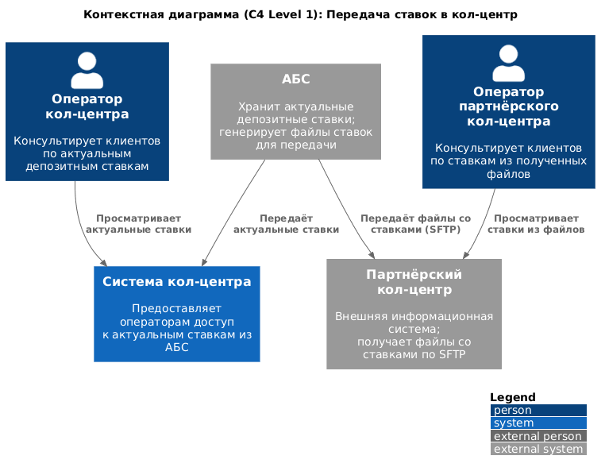
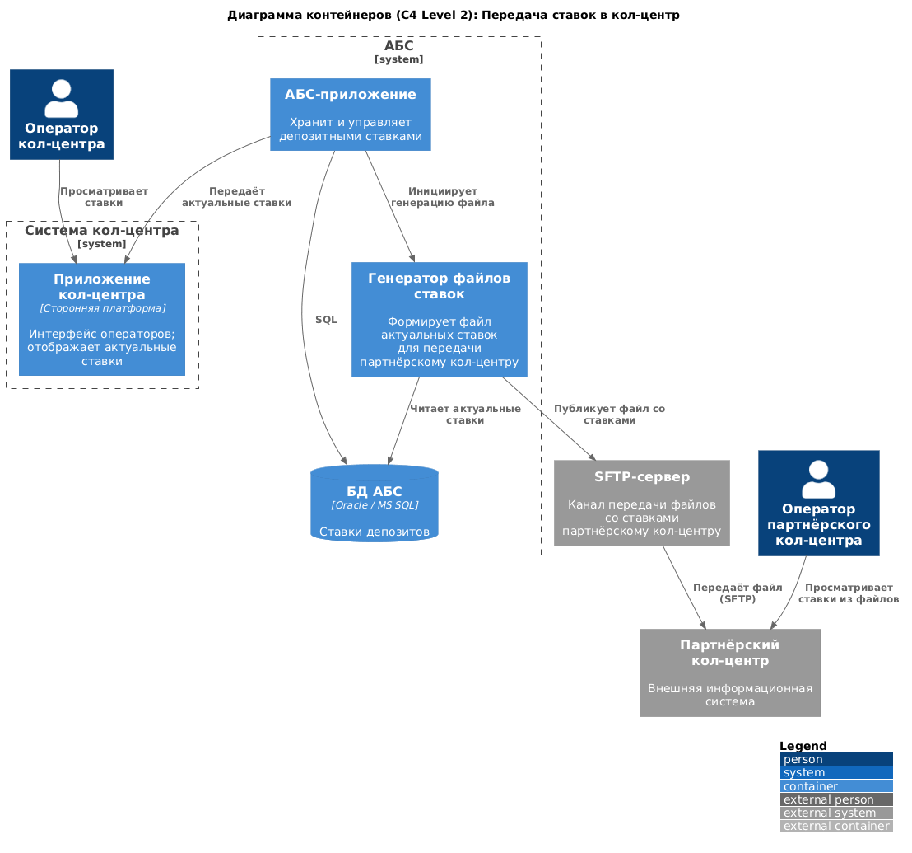

### **Название задачи:**
Передача ставок в кол-центр

### **Автор:**

### **Дата:**

---

### **Функциональные требования**

| **№** | **Действующие лица или системы** | **Use Case** | **Описание** |
| :-: | :- | :- | :- |
| 1 | Оператор кол-центра, Система кол-центра, АБС | Просмотр актуальных ставок | Оператор видит актуальные депозитные ставки в системе кол-центра для консультации клиентов |
| 2 | Оператор партнёрского кол-центра, Партнёрский кол-центр | Просмотр ставок из файла | Оператор партнёрского кол-центра видит ставки, полученные в файле, для консультации клиентов |
| 3 | АБС, SFTP, Партнёрский кол-центр | Передача файла со ставками | АБС генерирует файл актуальных ставок и передаёт его партнёрскому кол-центру по SFTP |

---

### **Нефункциональные требования**

| **№** | **Требование** |
| :-: | :- |
| 1 | Партнёрский кол-центр работает во внешней информационной системе — API-вызовы недоступны; передача ставок осуществляется файлами по SFTP |
| 2 | Использовать максимум существующих технологий; новые технологии должны быть совместимы с текущими платформами |
| 3 | Экспертиза по используемым технологиям должна быть в банке |

---

### **Решение**

#### Контекстная диаграмма (C4 Level 1)

АБС является источником актуальных депозитных ставок. Система кол-центра банка получает ставки из АБС напрямую. Партнёрский кол-центр как внешняя система не поддерживает API-вызовы — ставки передаются ему в виде файлов по SFTP.

---

#### Диаграмма контейнеров (C4 Level 2)

**АБС:**

| Контейнер | Технология | Назначение |
|---|---|---|
| АБС-приложение | — | Хранит и управляет депозитными ставками |
| Генератор файлов ставок | — | Формирует файл актуальных ставок для передачи партнёрскому кол-центру |
| БД АБС | Oracle / MS SQL | Ставки депозитов |

**Система кол-центра:**

| Контейнер | Технология | Назначение |
|---|---|---|
| Приложение кол-центра | Сторонняя платформа | Интерфейс операторов; отображает актуальные ставки из АБС |

**Ключевые интеграции:**

- АБС-приложение → Система кол-центра: прямая передача актуальных ставок
- АБС-приложение → Генератор файлов → SFTP → Партнёрский кол-центр: файловая передача ставок

---

### **Альтернативы**

| Альтернатива | Причина отклонения |
|---|---|
| API-вызовы к партнёрскому кол-центру | Партнёрский кол-центр работает во внешней информационной системе и не поддерживает API-интеграцию |

---

### **Недостатки, ограничения, риски**

- Файловый обмен не обеспечивает передачу ставок в реальном времени: ставки в партнёрском кол-центре обновляются только при получении нового файла.
- SFTP — дополнительная точка интеграции.
