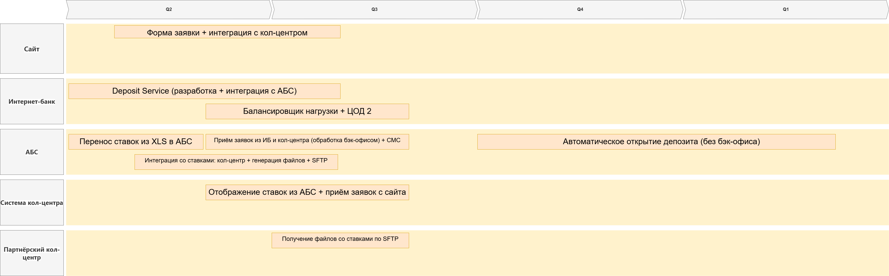

# Список крупных задач по системам

## Сайт
1. Форма подачи заявки на депозит (ФИО, телефон)
2. Интеграция с системой кол-центра (передача заявки на обратный звонок)

## Интернет-банк
1. Разработка Deposit Service (микросервис для приёма заявок на депозиты)
2. Асинхронная передача заявок на депозиты в АБС (без прямых API-вызовов)
3. Настройка балансировщика нагрузки
4. Горизонтальное масштабирование (ЦОД 1 + ЦОД 2)

## АБС
1. Перенос управления депозитными ставками из XLS в АБС
2. Предоставление актуальных ставок системе кол-центра
3. Генерация файлов со ставками для партнёрского кол-центра
4. Настройка передачи файлов по SFTP
5. Приём и обработка заявок из интернет-банка (бэк-офис, MVP)
6. Приём и обработка заявок из системы кол-центра (бэк-офис, MVP)
7. Отправка СМС-уведомлений (подтверждение ставки, открытие депозита)
8. [Целевое решение] Автоматическое подтверждение условий и открытие депозита без участия бэк-офиса

## Система кол-центра
1. Интеграция с АБС для отображения актуальных ставок операторам
2. Приём заявок от новых клиентов с сайта и передача в АБС

## Партнёрский кол-центр
1. Настройка получения файлов со ставками по SFTP
2. Обеспечение доступа операторов к ставкам из файлов
